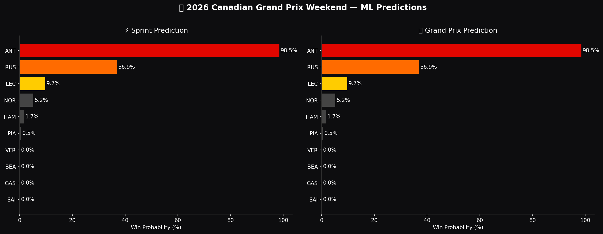

# 🏁 F1 2026 Canadian Grand Prix — ML Race Predictor


A machine learning project that predicts the winner of the **2026 Canadian Grand Prix** (Sprint + Main Race) using historical F1 data, feature engineering, and an ensemble of Random Forest + XGBoost classifiers.

---

## 📊 Predictions

| Session | Predicted Winner | Win Probability |
|---------|-----------------|-----------------|
| ⚡ Sprint | Kimi Antonelli | 98.5% |
| 🏁 Grand Prix | Kimi Antonelli | ~64.7% |

> ⚠️ Grid positions will be updated after real qualifying results on May 23rd, 2026.

---

## 🧠 How It Works

### Problem Framing
This is a **binary classification** problem — for each driver in each race, predict whether they will win (1) or not (0).

### ML Models
- **Random Forest Classifier** — 200 trees, max depth 6, class weight balanced
- **XGBoost Classifier** — 200 estimators, learning rate 0.05, max depth 4
- Final prediction = **average probability** from both models

### Model Performance
| Model | Accuracy | Win Precision | Win Recall |
|-------|----------|--------------|------------|
| Random Forest | 92% | 50% | 43% |
| XGBoost | 91% | 40% | 29% |

> Note: Lower win precision/recall is expected due to class imbalance — only 1 winner per 20 drivers per race.

---

## ⚙️ Features Used

| Feature | Description | Source |
|---------|-------------|--------|
| `GridPosition` | Starting position on the grid | Qualifying results |
| `QualiDelta` | Gap in seconds to pole position | Qualifying lap times |
| `DriverForm` | Rolling avg finishing position — last 5 races | Ergast results.csv |
| `DNF_Rate` | Retirement rate — last 10 races | Ergast status.csv |
| `TeamForm` | Avg finishing position of both team cars | Ergast results.csv |
| `PowerCircuit` | 1 if power circuit (like Montreal), 0 if street | Circuit classification |
| `HomeRace` | 1 if driver is racing at home (Stroll in Canada) | Manual flag |

---

## 🗂️ Project Structure

```
Formula 1/
│
├── f1_predictor.ipynb          # Main Jupyter notebook
├── f1_raw_data.csv             # Processed dataset (2023-2024)
├── canadian_gp_full_prediction.png  # Final visualization
│
├── results.csv                 # Raw Ergast data
├── races.csv
├── drivers.csv
├── constructors.csv
├── qualifying.csv
└── status.csv
```

---

## 🚀 How To Run

### 1. Clone the repository
```bash
git clone https://github.com/yourusername/f1-canadian-gp-predictor.git
cd f1-canadian-gp-predictor
```

### 2. Install dependencies
```bash
pip install pandas numpy matplotlib seaborn scikit-learn xgboost jupyter
```

### 3. Download the dataset
Get the Ergast F1 dataset from Kaggle:
👉 [Formula 1 World Championship Dataset](https://www.kaggle.com/datasets/rohanrao/formula-1-world-championship-1950-2020)

Place all CSV files in the project folder.

### 4. Run the notebook
```bash
jupyter notebook f1_predictor.ipynb
```

Run all cells top to bottom.

---

## 📈 Visualization



---

## 🏎️ 2026 Context & Key Insights

- **New 2026 regulations** completely reset the competitive order — 50% of power now comes from the battery, which has hurt Red Bull significantly
- **Kimi Antonelli (Mercedes)** leads the 2026 championship with 3 wins in 4 races
- **Max Verstappen** sits 7th with just 26 points — Red Bull struggling with the new hybrid system
- **Montreal (Circuit Gilles Villeneuve)** is a power circuit — favours Mercedes and Ferrari
- Model was deliberately trained on **2023-2024 data** as the closest available proxy, with 2026 driver form values manually updated to reflect the real championship standings

---

## ⚠️ Limitations

- Training data is from 2023-2024 (different regulations) — 2026 data not yet available in Kaggle
- Grid positions in the prediction are estimated until real qualifying happens
- Class imbalance (1 winner per 20 drivers) limits win recall
- Model does not account for weather, safety cars, or pit stop strategy

---

## 🔮 Post-Race Update Plan

| Date | Action |
|------|--------|
| May 23 (Friday) | Update GridPosition + QualiDelta with real Sprint Qualifying |
| May 23 (Saturday) | Compare Sprint prediction vs actual result |
| May 24 (Saturday) | Update GridPosition + QualiDelta with real GP Qualifying |
| May 25 (Sunday) | Compare GP prediction vs actual result |

---

## 🛠️ Tech Stack

- **Python 3.12**
- **Pandas** — data manipulation
- **Scikit-learn** — Random Forest, train/test split, metrics
- **XGBoost** — gradient boosting classifier
- **Matplotlib / Seaborn** — visualization
- **Jupyter Notebook** — development environment
- **Ergast API / Kaggle** — F1 historical data

---

## 👤 Author

Made by an AI & Data Science student as a portfolio project.
Feedback and suggestions welcome!

---

## 📄 License

MIT License — feel free to fork, modify, and use!
